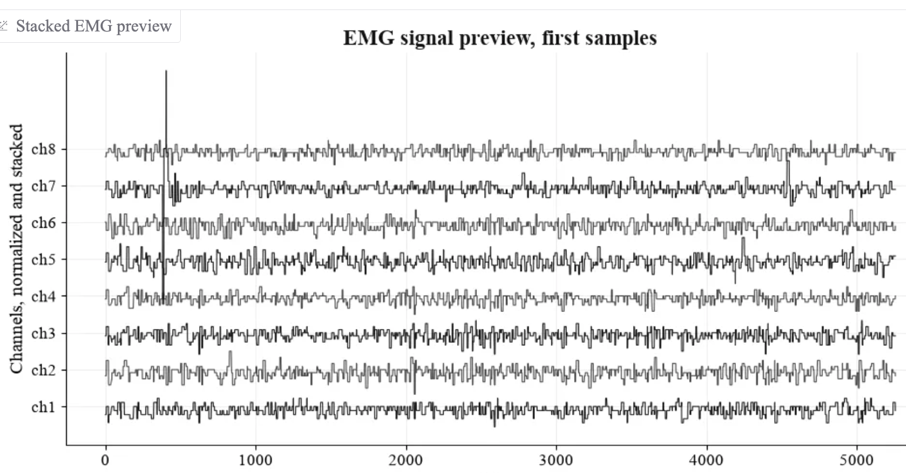
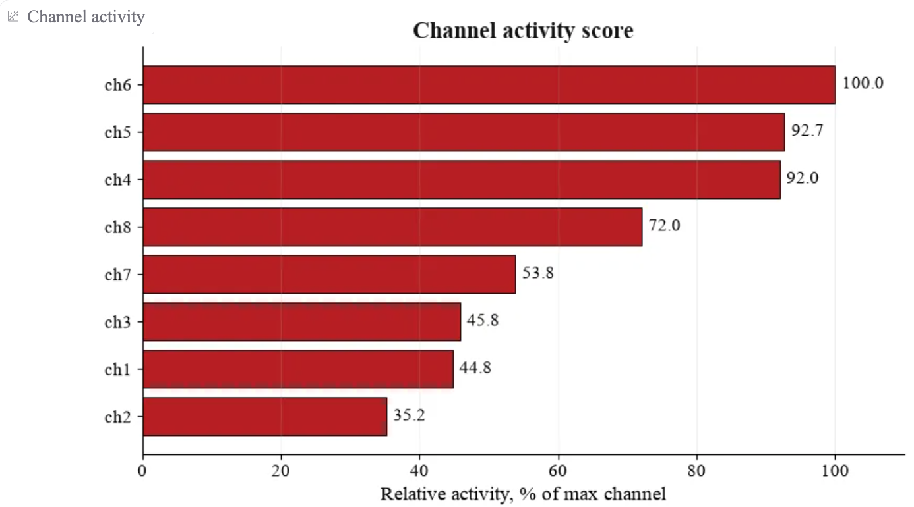
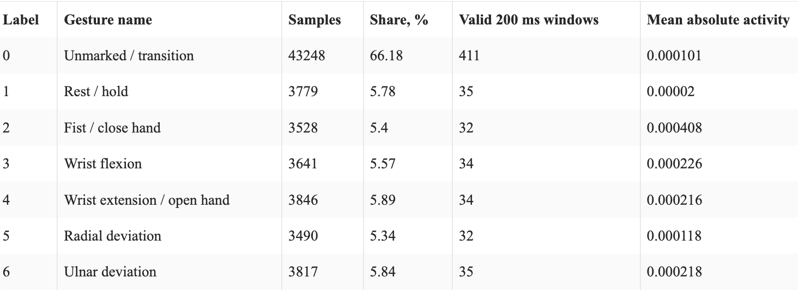
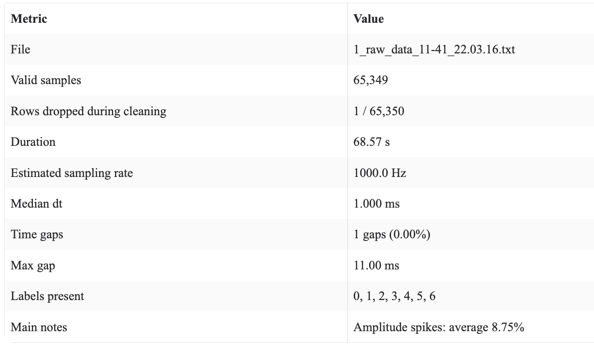

# EMG Signal Quality Analyzer


**EMG Signal Quality Analyzer** is a local Gradio application for analyzing raw electromyography (EMG) recordings.

The app helps inspect EMG signal quality before using the data for gesture recognition, calibration, machine learning experiments, or biomedical signal analysis. It checks timing consistency, channel activity, spikes, flatline channels, missing values, gesture-label coverage, and valid signal windows.

---

## Preview

### Signal Preview



### Channel Activity



### Gesture Labels



### Overview



---

## Project 

EMG signals are commonly used in gesture recognition, prosthetic control, rehabilitation systems, human-computer interaction, and biomedical signal processing. However, raw EMG recordings often contain noise, missing values, unstable timing, inactive channels, spikes, or incomplete gesture labels.

This application provides a simple local interface for quickly checking whether an EMG recording is suitable for further analysis.

The project is focused on **data quality inspection**, not on medical diagnosis.

---

## Key Features

The application analyzes uploaded EMG recordings and provides:

* automatic reading of `.txt` and `.csv` files;
* support for files with or without a header row;
* support for whitespace, comma, and semicolon separators;
* sampling rate estimation;
* detection of time gaps and irregular timestamps;
* numeric cleaning and invalid row detection;
* per-channel activity analysis;
* RMS, MAV, and amplitude range calculation;
* flatline channel detection;
* amplitude spike detection;
* gesture label distribution analysis;
* estimation of valid 200 ms signal windows;
* diagnostic indicators for signal quality;
* visual plots for quick inspection.

---

## Expected Input Format

The uploaded file should contain 10 columns:

```text
time ch1 ch2 ch3 ch4 ch5 ch6 ch7 ch8 label
```

Where:

| Column        | Description               |
| ------------- | ------------------------- |
| `time`        | Timestamp or time index   |
| `ch1` - `ch8` | EMG signal channels       |
| `label`       | Gesture or activity label |

The app supports files with or without a header row.

If no file is uploaded, the application automatically analyzes the built-in demo file:

```text
data_examples/demo_emg_signal.txt
```

---

## How It Works

The analysis pipeline includes several stages:

1. **File loading**
   The app reads the uploaded EMG file and detects its structure.

2. **Data cleaning**
   Numeric columns are parsed and invalid rows are identified.

3. **Timing analysis**
   The app estimates the sampling rate and detects possible time gaps.

4. **Channel diagnostics**
   Each EMG channel is analyzed using activity metrics such as RMS, MAV, and amplitude range.

5. **Spike detection**
   The app detects abnormal amplitude spikes by channel.

6. **Flatline detection**
   Channels with very low variation are marked as potentially inactive.

7. **Label analysis**
   Gesture labels are counted and checked for coverage.

8. **Window estimation**
   The app estimates how many valid 200 ms windows can be extracted from the recording.

9. **Visualization**
   The results are shown through tables, diagnostic indicators, and plots.

---

## Installation

Clone the repository:

```bash
git clone https://github.com/akemi-aiai/emg-signal-quality-analyzer.git
cd emg-signal-quality-analyzer
```

Create a virtual environment:

```bash
python3 -m venv .venv
```

Activate it:

```bash
source .venv/bin/activate
```

Install dependencies:

```bash
python -m pip install --upgrade pip
pip install -r requirements.txt
```

---

## Run the Application

Start the Gradio app:

```bash
python emg_signal_quality_analyzer.py
```

Then open the local URL in your browser:

```text
http://127.0.0.1:7860
```
---

## Safety Check

The repository includes a simple safety check script:

```bash
python scripts/check_safety.py
```

This script checks the project files for suspicious patterns and helps confirm that the application is safe to run locally.

---

## Dependencies

Main libraries used in the project:

* `gradio`
* `pandas`
* `numpy`
* `matplotlib`

Install all dependencies with:

```bash
pip install -r requirements.txt
```

---

## Example Use Cases

This tool can be useful for:

* checking raw EMG recordings before model training;
* preparing EMG data for gesture recognition experiments;
* detecting corrupted or low-quality signal files;
* finding inactive or noisy channels;
* evaluating whether a recording contains enough valid gesture data;
* building a preprocessing workflow for biomedical signal projects.

---

## Limitations

This application is designed for exploratory signal quality analysis. It does not provide medical conclusions and should not be used as a diagnostic system.

Current limitations:

* it expects an 8-channel EMG format;
* it focuses on data quality, not gesture classification;
* it does not train a machine learning model;
* thresholds may need adjustment for different devices or datasets.

---

## Future Improvements

Possible next steps:

* add automatic report export;
* support more EMG file formats;
* add configurable thresholds;
* add frequency-domain analysis;
* add filtering options;
* add machine learning-based signal quality scoring;
* add gesture classification pipeline.

---

## Author

Created by [akemi-aiai](https://github.com/akemi-aiai).

---

## License

This project is intended for educational and portfolio purposes.
